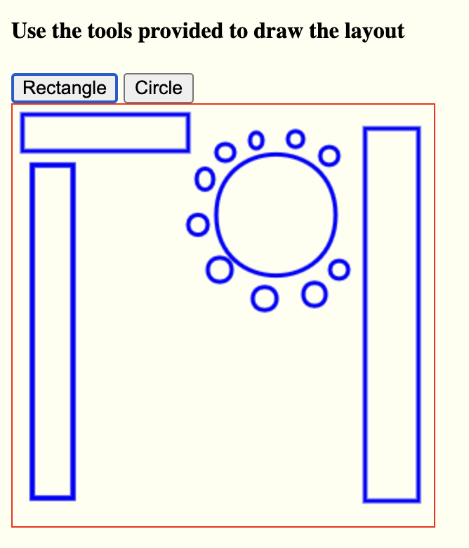

# Lineup Layout Drawing app

## Steps to run the project

- Clone the project from this repo
- cd to the lineUpApp folder
- Open the app on the browser using any http server

## Current scope of the project

- The base project let's users select between a rectange and a circle

## Future enhancements

- Including additional shapes
- Allow users to change the stroke thickness
- Allow users to change stroke colors and add fills to the shapes
- Option to save and load layout diagrams

## Sample Screenshot

